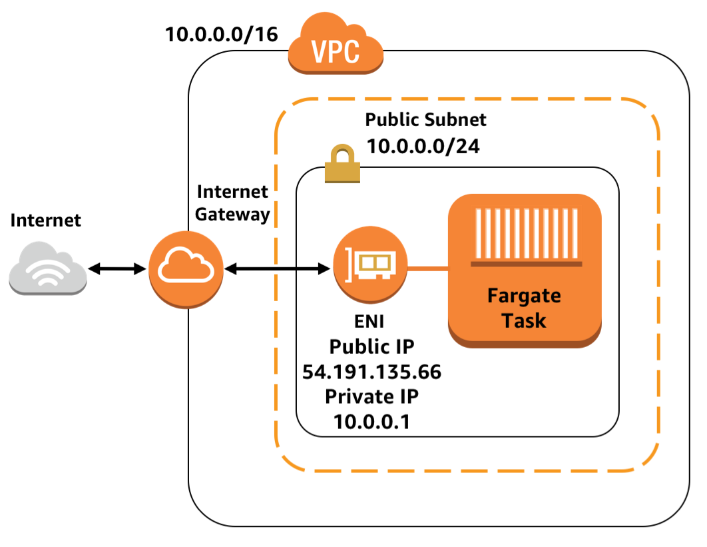
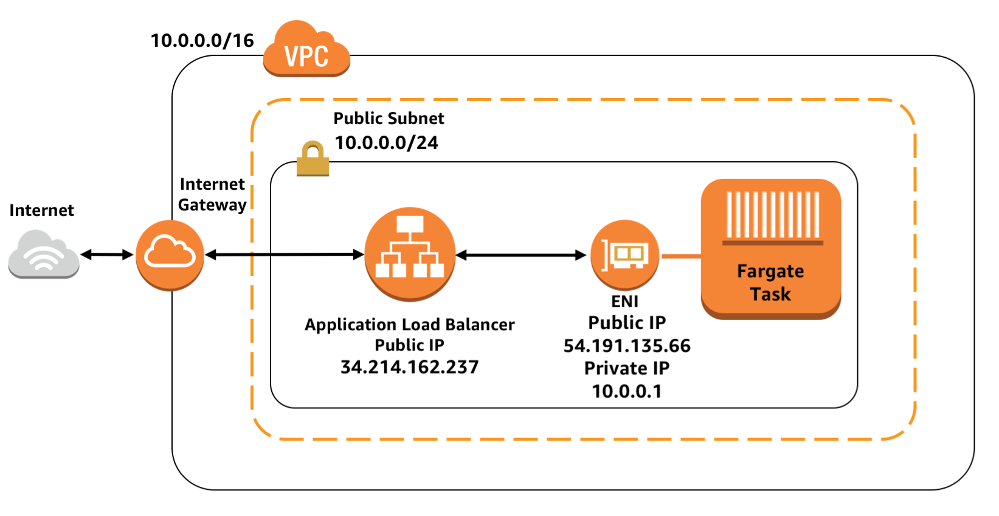
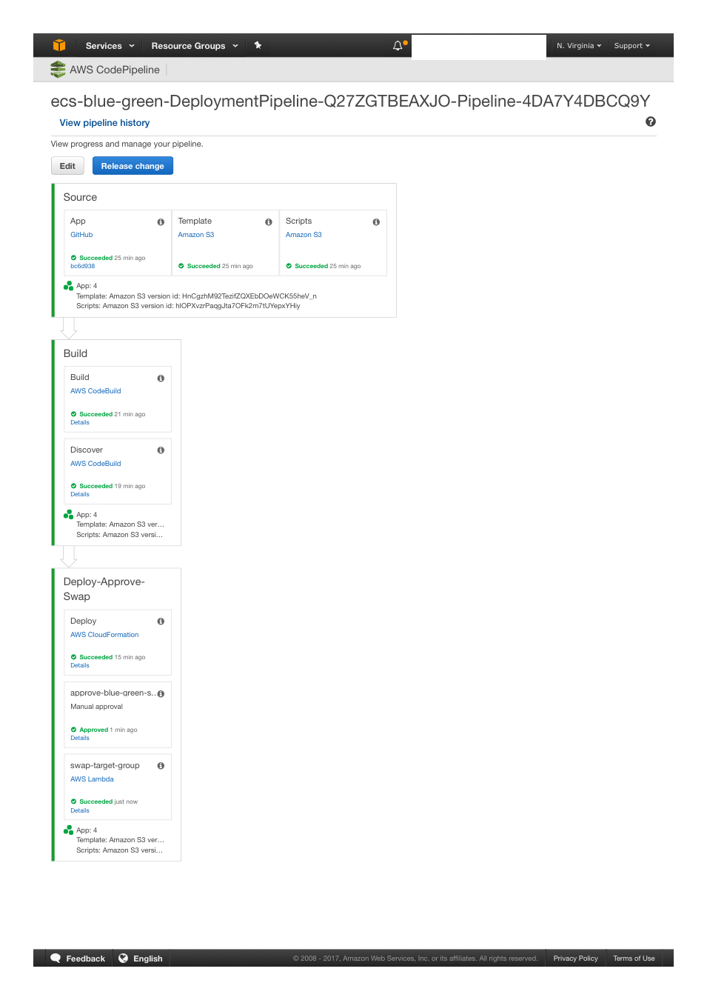
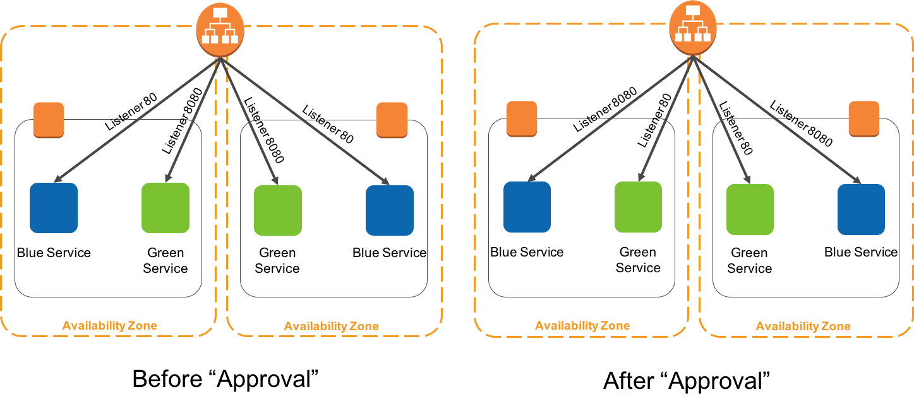

# IllumiDesk's CI/CD

Everybody's delivery pipeline has different requirements, but they all follow a number of basic forms. In this document, we're going to share a common pipeline configuration we set up with IllumiDesk.

## TOC

- [IllumiDesk's CI/CD](#illumidesks-cicd)
  - [TOC](#toc)
  - [Overview](#overview)
  - [Blue/Green deployments on AWS ECS](#bluegreen-deployments-on-aws-ecs)
  - [Pre-Requisites](#pre-requisites)
  - [Quick setup in three steps](#quick-setup-in-three-steps)
      - [1. Fork `illumidesk/app-backend`](#1-fork-illumideskapp-backend)
      - [2. Run bin/deploy](#2-run-bindeploy)
  - [Github, Docker and Travis-CI](#github-docker-and-travis-ci)
  - [Release Branches](#release-branches)
  - [Registry and Tagging](#registry-and-tagging)
  - [Rollout Setup](#rollout-setup)
  - [Releases and Rollbacks](#releases-and-rollbacks)
  - [Infrastructure Deployment](#infrastructure-deployment)
    - [Networking](#networking)
    - [Services](#services)
    - [Resources Created](#resources-created)
    - [Implementation details](#implementation-details)
    - [Deployment Status and Notifications](#deployment-status-and-notifications)
    - [Trouble Shooting](#trouble-shooting)
      - [Travis Builds](#travis-builds)

## Overview

Our workflow starts with Github. We set up a branch that will trigger a deploy after successful Continuous Integration (CI) build. The CI is expected to build containers and run tests as usual, but with this branch it does two more steps. First it pushes the image to a registry. Then it triggers a rollout on the cluster. During the rollout, tests will validate that the new version of the application (`green`) is safe to promote to the latest stable version (`blue`). This is accomplished by segregating `blue/green` environments behind dedicated AWS target groups behind an Application Load Balancer. This last step is the trickiest mechanism, but we'll cover each previous step in more detail as well.

## Blue/Green deployments on AWS ECS

This architecture creates a continuous delivery pipeline by leveraging [Terraform](https://www.terraform.io/) templates. The templates create resources using Terraform and Amazon's Code* services in conjunction with Travis-CI to build and deploy containers onto an ECS cluster as long running services. It also includes a manual approval step facilitated by lambda function that discovers and swaps target group rules between 2 target groups, promoting the green version to production and demoting the blue version to staging.

> Note: We are currently testing AWS's CodeBuild and CircleCI as potential replacements for Travis-CI, as their recent acquisition has increased risks with this vendor.

## Pre-Requisites

- [AWS Command Line Interface](http://docs.aws.amazon.com/cli/latest/userguide/cli-chap-welcome.html)
- Active account with [Travis-CI](https://travis-ci.com)

> There is no need to install additional dependencies locally. Tools that are used during the testing and deployment stages are installed using the CI tool.

Please follow [instructions](http://docs.aws.amazon.com/cli/latest/userguide/installing.html) if you haven't installed AWS CLI. Your CLI [configuration](http://docs.aws.amazon.com/cli/latest/userguide/cli-chap-getting-started.html) needs PowerUserAccess and IAMFullAccess [IAM policies](http://docs.aws.amazon.com/IAM/latest/UserGuide/access_policies.html) associated with your credentials.

Your **AWS CLI version should be >= 1.11.37**. You can verify your current version with the following command:

```
awscli --version
```

## Quick setup in three steps

#### 1. Fork `illumidesk/app-backend`

[Fork](https://help.github.com/articles/fork-a-repo/) or clone the [IllumiDesk core backend app](https://github.com/illumidesk/app-backend) GitHub repository:

```console
git clone https://github.com/<your_github_username>/app-backend
```

#### 2. Run bin/deploy

```console
bash scripts/bin/deploy
```

Here are the inputs required to launch the Terraform templates:

  * **S3 Bucket**: Enter S3 Bucket for storing your CloudFormation templates and scripts. This bucket must be in the same region where you wish to launch all the AWS resources created by this example.
  * **CloudFormation Stack Name**: Enter CloudFormation Stack Name to create stacks
  * **GitHubUser**: Enter your GitHub Username
  * **GitHubToken**: Enter your GitHub Token for authentication ([https://github.com/settings/tokens](https://github.com/settings/tokens))

After the templates are created, you can open ELB DNS URL to access the API.

For testing Blue Green deployment, make a change in the `illumidesk/app-backend` app. For example, edit the `admin/login` view to display updated text. After committing, creating a PR, and merging to master, the pipeline will pick the change automatically and go through the process of updating your application.

Click on "Review" button in Code pipeline management console and Approve the change. Now you should see the new version of the application with Green background.

## Github, Docker and Travis-CI

The first step is setting your project up with a CI system. Especially with `Docker`, the only major requirement is being able to run Docker containers since everything else about the environment is containerized. Our other main requirement in choosing a CI is making its configuration exist with the app source code, not in a web interface or the CI's
configuration.

We also prefer hosted solutions since they're free to cheap and worth not managing more infrastructure. Below you will find configuration instructions for TravisCI, but other CI solutions are also roughly equivalent. [Travis-CI](https://www.travis-ci.com) allows us to keep things very simple and are mostly configured via a configuration file in the repo's source. Some data like secrets still need to be added in the Travis-CI UI, but this is good if not ideal.

## Release Branches

We prefer setting up a `release` branch. Some people want to use `master`, but we like having a "gold master" source branch that's separate from deployments. IllumiDesk currently has one release branch, `production`, but is in the process of adding a second release branch, `staging`.

The release branch is a one-way trigger. Nobody works off this branch and it's never merged into any other branch. Although you can push directly to it, use Github's Pull Request mechanism to prepare deploys, almost always from `master` into the `release` branch. This allows for review, showing all changes going into production since last deploy, and discussion with relevant stakeholders on the Github interface.

**The merge button becomes your deploy button**.

The CI will often perform several passes of tests before deploying. First, it runs on `master` as commits are pushed to it. Then again against `master` once the PR is made. Then when merged it will run tests against the `release` branch. Ultimately, tests will be run 3 times for this code, which is quite honestly unnecessary, but also doesn't hurt.

To recap:

1. Pull Requests trigger style, unit and integration tests.
1. Various third party services help assist with the review process. For example, code coverage is updated and tracked with [Codecov](https://codecov.io).
1. Once the pull request review has been approved, a maintainer has the option to merge the PR to the master branch. It is important to note that all PRs from repo forks should merge into the master branch.
1. **The master branch is always a deployable branch**. Therefore additional validations could take place using the master branch. For example, someone could fetch a particular commit from the master branch for additional testing.
1. A new Pull Request is created from master branch to one of the release branches.
1. The Pull Request review process is initiated. Once approved the Pull Request is merged.
1. Merges to a release branch will trigger a deployment to the corresponding environment.

Once merged into the `release` branch and tests pass, your CI configuration will tell the CI to do some extra deploy steps.

Here is an example configuration snippet for `Travis-CI` for this:

```
sudo: required

language: python
python:
  - "3.6"

services:
  - docker

branches:
  only:
    - master
    - production

before_install:
  - echo "before_install step"
  - bash scripts/travis/before_install.sh

install:
  - echo "install step"
  - bash scripts/travis/install.sh

script:
  - echo "script step"
  - bash scripts/travis/script.sh

env:
  global:
    - AWS_ECR_ACCOUNT=$AWS_ECR_ACCOUNT
    - DOCKER_IMAGE_NAME=$DOCKER_IMAGE_NAME
```

This is just an example. The steps performed are explained in the following sections.

## Registry and Tagging

You'll need a Docker registry to store built images ready for rollout. Most cloud providers also have their own Docker registries available. You can also run your own registry backed by S3 or another filestore. IllumiDesk has chosen to use AWS's ECS Registry, known as `ECR`.

You'll notice we tag the image with both the `build number` and the `latest` tags. Using the `latest` tag allows us to share images with the team more easily. However, we treat these as build artifacts, so we also tag images based on the build number. This allows us to trace a deployment to a CI build, to a PR, etc.

Credentials to the registry need to be made available to your CI environment so you can perform a `docker login`. Typically with environment variables. Since they're secret, they shouldn't be in your source configuration unless they're encrypted. Travis-CI allows you to set environment variables in the settings section and encrypt the values for the env vars so they are not exposed during CI runs.

## Rollout Setup

Rollout, the opposite of a rollback, is the step in deployment that actually runs the latest build and configures them for use (load balancer, etc). This step is an orchestration step that's different based on your infrastructure stack. It can also be different based on your rollout strategy.

For example, a common strategy is to run new services in parallel with the old, without traffic routed to them, and only after they're all running and passing health checks, the load balancer switches to them automatically and the old services are stopped. This requires a lot of moving parts, and, fortunately, AWS has release a service that allows companies to rollout containers using a managed service, known as `AWS ECS Foundry`.  

We've therefore followed a more pragmatic approach and simply connect to the AWS ECS environment using the AWS CLI commands after all tests have passed.

## Releases and Rollbacks

We also like to model [12 Factor](http://12factor.net/)
[Releases](http://12factor.net/build-release-run). Luckily, ECS Task Definitions contain everything to model releases. Or rather, they effectively are releases, but we like to have automation in place to manage configuration more easily, and handle rollbacks to previous releases. Both are also out of the scope of the current version of IllumiDesk's deployments, but can be done in this case by hand using the AWS ECS web console.

## Infrastructure Deployment

This workflow covers application delivery, but it leaves out infrastructure delivery. We treat this with the same level of importance and automation towards continuous delivery. If you want to deploy your app *from scratch*, we assume that includes your provisioned infrastructure.

We do automate infrastructure deployment using Hashicorp's [`Terraform`](https://www.terraform.io/) and bash scripts. Currently, the IllumiDesk stack considers the following infrastructure setup for it's `Terraform` scripts:

- Application Load Balancer (ALB)
- Virtual Private Cloud (VPC) with internet gateway, routing, and security groups.
- Elastic Container Service (ECS) clusters, services, task definitions, and registry using the Fargate option for the backend stack and the EC2 option for user workspaces
- RDS service with Postgres
- ElastiCache service with Redis
- CodePipeline definitions
- IAM roles
- CloudWatch

### Networking



Fully public networking stack. All containers launched in this stack will have public IP addresses and can be directly accessible on the internet via an internet gateway, or indirectly accessible via a public facing load balancer. (Note that by default the security groups are configured so that the containers only accept traffic from the load balancer, even though they have public IP addresses. The capability for direct access is there if the security group is changed though.)

### Services



This option requires the public subnet or public + private subnet networking stack. It launches containers that have public IP addresses in a public subnet, so they are directly accessible to the public. It also associates the containers with a public facing load balancer.

### Resources Created

Count | AWS resources
| --- | --- |
7   | [AWS CloudFormation templates](https://aws.amazon.com/cloudformation/)
1   | [Amazon VPC](https://aws.amazon.com/vpc/) (10.215.0.0/16)   
1  | [AWS CodePipeline](https://aws.amazon.com/codepipeline/)
2  | [AWS CodeBuild projects](https://aws.amazon.com/codebuild/)
1  | [Amazon S3 Bucket](https://aws.amazon.com/s3/)
1  | [AWS Lambda](https://aws.amazon.com/lambda/)
1  | [Amazon ECS Cluster](https://aws.amazon.com/ecs/)
2  | [Amazon ECS Service](https://aws.amazon.com/ecs/)
1  | [Application Load Balancer](https://aws.amazon.com/elasticloadbalancing/applicationloadbalancer/)
2  | [Application Load Balancer Target Groups](https://aws.amazon.com/elasticloadbalancing/applicationloadbalancer/)

### Implementation details

During first phase, the parent template (ecs-blue-green-deployment.yaml) kicks off creating VPC and the resources in deployment-pipeline template. This creates CodePipeline, CodeBuild and Lambda resources. Once this is complete, second phase creates the rest of resources such as ALB, Target Groups and ECS resources. Below is a screenshot of CodePipeline once all CloudFormation templates are completed



The templates create two services on ECS cluster and associates a Target Group to each service as depicted in the diagram. Blue Target Group is associated with Port 80 that represents Live/Production traffic and Green Target Group is associated with Port 8080 and is available for new version of the Application.

The new version of the application can be tested by accessing the load balancer at port 8080, example http://LOAD_BALANCER_URL:8080 .If you want to restrict the traffic ranges accessing beta version of the code, you may modify the Ingress rules [here](https://github.com/awslabs/ecs-blue-green-deployment/blob/master/templates/load-balancer.yaml#L30).

During initial rollout, both Blue and Green service serve same application versions. As you introduce new release, CodePipeline picks those changes and are pushed down the pipeline using CodeBuild and deployed to the Green service. In order to switch from Green to Blue service (or from beta to Prod environment), you have to _Approve_** the release by going to CodePipeline management console and clicking _Review_** button.

Approving the change will trigger Lambda function (blue_green_flip.py) which does the swap of ALB Target Groups. If you discover bugs while in Production, you can revert to previous application version by clicking and approving the change again. This in turn will put Blue service back into Production. To simplify identifying which Target Groups are serving Live traffic, we have added Tags on ALB Target Groups. Target Group **IsProduction** Tag will say **true** for Production application.



Here is further explanation for each stages of Code Pipeline.  

**During Build stage**

* During first phase, Travis-CI builds the docker container image and pushes to
[Amazon ECR](https://aws.amazon.com/ecr/).

* During second phase, Travis-CI executes scripts/deployer.py which executes the following scripted logic

  1. Check if the load balancer exists. Name of the ELB is fed through environment variable by the pipeline.
  1. Get tag key value of the target group, running on port 8080 and 80 with KeyName as "Identifier". It will be either "Code1" or "Code2"
  1. Get Sha of the image id running on target group at port 8080 and 80
  1. Edit the build.json retrieved from step-1 and append the values retrieved in step3 and step4
  1. Save the modified build.json. This file is the output from codebuild project and fed as an input to the CloudFormation execution stage.This json file has the following schema:
  
  ```json
      {
        "Code1" : "CONTAINER_TAG1",
        "Code2" : "CONTAINER_TAG2"
      }
  ```
  
  If the load balancer does not exists (as found in step-2), this would imply that the stack is executed for the first time, and the values of "CONTAINER_TAG1" and "CONTAINER_TAG2" will be the same and default to the value retrieved from build.json in step-1

**During Deploy stage**
CodePipeline executes templates/ecs-cluster.yaml. The CloudFormation input parameters with KeyName as "Code1" and "Code2" are overwritten with the values as written in the build.json, retrieved from the second phase of Build Stage.

**During Review stage**
The pipeline offers manual "Review" button so that the approver can review code
and Approve new release. Providing approvals at this stage will trigger the Lambda function (blue_green_flip.py) which swaps the Green Target Group to Live traffic. You can checkout sample app to see new release change. blue_green_flip.py has the following logic scripted

   1. Read Job Data from input json
   2. Read Job ID from input json
   3. Get parameters from input json
   4. Get Load balancer name from parameters
   5. Identify the TargetGroup running on this Load Balancer at port 80 and port 8080.
   Perform the TargetGroup Swap. Also swap the values of "IsProduction" tags.
   6. Send success or failure to CodePipeline

### Deployment Status and Notifications

Deployment statuses are dispatched centrally with GitHub, considering that `git` release branches are how we trigger deployments.

Deployment state and notification workflow should follow this general pattern:

```
+----+               +--------+                +----+              +-------+
| CI |               | GitHub |                | CD |              | Cloud |
+----+               +--------+                +----+              +-------+
  |                      |                       |                     |
  |  Create Deployment   |                       |                     |
  |--------------------->|                       |                     |
  |                      |                       |                     |
  |  Deployment Created  |                       |                     |
  |<---------------------|                       |                     |
  |                      |                       |                     |
  |                      |   Deployment Event    |                     |
  |                      |---------------------->|                     |
  |                      |                       |    SSH + Deploys    |
  |                      |                       |-------------------->|
  |                      |                       |                     |
  |                      |   Deployment Status   |                     |
  |                      |<----------------------|                     |
  |                      |                       |                     |
  |                      |                       |   Deploy Completed  |
  |                      |                       |<--------------------|
  |                      |                       |                     |
  |                      |   Deployment Status   |                     |
  |                      |<----------------------|                     |
  |                      |                       |                     |
```

> Note how the above workflow only mentions GitHub as a vendor. Other CI tools and deployment environments can change, which is one of the advantages of decoupling deployments notifications from tooling.

The deployment scripts validate various settings and then updates GitHub's deployment endpoint with the latest deployment status:

- Validate repo namespace
- Confirm build link
- Create notification and build bodies based on deploy result
- Assign deployment values accepted by the [GitHub deployment endpoints](https://developer.github.com/v3/repos/deployments/#list-deployments)
- Create a deployment for the repo slug with the `illumideskbot` user and deployment values from the first step
- Notify GitHub repo about successful or failed deployments

Thanks to GitHub's native integration with Slack, no additional configuration is required to receive GitHub notifications in Slack. If you need to send event
payloads to other services, use [GitHub's webhook integration option](https://developer.github.com/webhooks/) available in the repo settings.

### Trouble Shooting

#### Travis Builds

To trouble shoot Travis-CI builds, [follow the instructions described here](https://docs.travis-ci.com/user/running-build-in-debug-mode/) to run the build in debug mode.